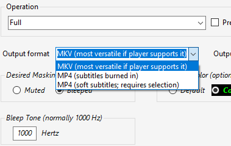
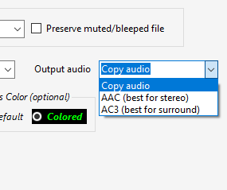
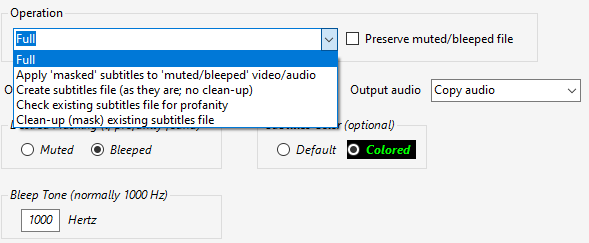
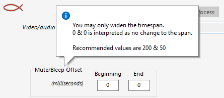
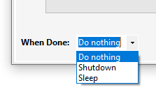
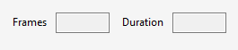

<!--
  Title: Defilthify
  Description: Movie/video profanity removal tool. Automatic unwholesome language cleanup.
  Author: Joe Rodriguez
  -->
<meta name='keywords' content='profanity removal tool, audio cleanup, subtitles cleanup'>
  
# Defilthify
## Movie/video profanity removal tool

Defilthify is a tool for removing profanity from movies, video, and audio files. It will create subtitles from the audio, remove the profanity from both the subtitles and the audio, and re-merge the three components back into an output file.

The program has additional capabilities via five different modes:  

1. &emsp;Full
2. &emsp;Apply ‘masked’ subtitles to ‘muted/bleeped’ video/audio
3. &emsp;Create subtitles file (as they are; no clean-up)
4. &emsp;Check existing subtitles file for profanity
5. &emsp;Clean-up (mask) existing subtitles file  

The output is rendered in either MKV or MP4. If outputing to MP4 you have the choice of burned-in subtitles (automatic) or ‘soft subtitles’ (requires selection when playing). The audio output choices are ‘Copy’ (pass-through), AAC, and AC3. Furthermore, the channels are preserved, i.e., mono to mono, stereo to stereo, 5.1 to 5.1.

&emsp;&emsp;

The subtitles masking is rendered either ‘muted’ or ‘bleeped’. If ‘bleeped’ is chosen you also have the ability to select the frequency of the tone. Either way you can select the color of the subtitles or set it to systemt default.

You may either input a video file or an audio file. If audio is chosen then a small black screen is created and the subtitles are viewed on it. Transcription of audio files is useful for users who assimilate information better when reading while listening.

The interface of Defilthify is simple and intuitive, yet versatile enough that it allows control over the most common parameters.

### Modes

- ***Full*** :&emsp;This will perform the entire process of inputting a file, transcribing a speech-to-text narrative (subtitles), quickly evaluating whether at least one occurrence of objectionable language exists and if it does then a second (word-level) transcription is performed down to the millisecond to obtain the ‘masking’ timestamps. These timestamps are used to mute/bleep the audio. The word-level transcription is filtered with the profanity list and the words are masked with a string of asterisks (*) equal to the length of the word. The three components, video, audio, and subtitles (word-level transcription) are subsequently multiplexed back into an output product. Obviously if the aforementioned evaluation finds no profanity then the second time-consuming transcription is bypassed as well as the masking process. With this mode the user has the option of preserving the intermediate MP4 file for a future process. This file, which is normally not kept in an effort to minimize HDD usage, has a run timestamp appended which matches the masked narrative subtitles file.

- ***Apply ‘masked’ subtitles to ‘muted/bleeped’ video/audio*** :&emsp;If the intermediate MP4 file mentioned in the Full process was preserved, then the user may at a later time re-merge this timestamp-matched subtitles file with the muted/bleeped MP4 after he/she optionally edits the subtitles.

- ***Create subtitles file (as they are; no clean-up)*** :&emsp;This option allows the user to create a subtitles narrative file from the movie/video (as is, verbatim) with no cleaning of profanity for whatever need he/she has.

- ***Check existing subtitles file for profanity*** :&emsp;If the user has extracted or downloaded an SRT file for a movie, this option enables him/her to see if it contains profanity and optionally to save the results to a TXT file. The file will show the profanities and the exact timestamps where they occur.

- ***Clean-up (mask) existing subtitles file*** :&emsp;This possibly needs no explanation. It will produce a cleaned masked version of a dirty subtitles file and the name appended with (masked).

### Miscellany
$\color{red}{Mute/Bleep\ offsets}$ are available in order to fine-tune the 'beginning' & 'end' of millisecond-precise timestamps. If the user finds that their computer is slower than desired, the beginning can be hastened and the end can be delayed to satisfactory results, thus widening the span. These settings are stored and remembered from session to session.

When a long operation is expected and the user has no desire to wait, or if it will run late into the night, a $\color{red}{When Done}$ control is available to 'shutdown' the machine when finished. An abort button is also available to cancel the 'shutdown' within 30 seconds of issuing the command.

The $\color{red}{Frames}$ & $\color{red}{Duration}$ boxes are informational only. The are used internally in displaying the progress bar.

### Static Settings
Upon first run a quick setup must be made. This consists of selecting the locations of four worker program executables (specified below) and the output folder of your choice. All five selections must be made before access to the ‘Main’ or ‘Selections’ screens is granted.

### Background Worker Programs
$\color{cyan}{ffmpeg.exe}$ :&emsp;A free, open-source progarm included in the **ffmpeg** software suite consisting of a command-line tool and libraries used to decode, encode, transcode, and stream audio and video. It handles virtually every media format ever created.

$\color{cyan}{ffprobe.exe}$ :&emsp;A companion tool included in **ffmpeg** used to analyze and view technical metadata of media files (such as codecs, resolutions, bitrates, frames, and duration).

$\color{cyan}{faster-whisper-xxl.exe}$ :&emsp;An optimized, standalone speech-to-text engine that packages voice activity detection, audio preprocessing, and speaker diarization into a single plug-and-play package. **faster-whisper-xxl** was written by GitHub user known as **Purfview** and built on top of machine learning engineer Guillaume Klein’s **faster-whisper**.&emsp;**faster-whisper-xxl** is designed for users who want to avoid Python installation.

$\color{cyan}{mkvmerge.exe}$ :&emsp;A command-line tool used to create, join, split, or inspect Matroska (.mkv, .mka, .mks) files by combining audio, video, and subtitle streams without re-encoding. It is a core component of and included in the **MKVToolNix** software package.

### Downloading Background Worker Programs

$\color{cyan}{ffmpeg.exe}$ and $\color{cyan}{ffprobe.exe}$ :

Check; you may already have it somewhere in your computer. If not then read on: FFmpeg is available in portable version (no installation required). Go to the official [ffmpeg.org download page](https://ffmpeg.org/download.html), hover over the Windows icon, and select a trusted Windows build provider like Gyan Duggirala's builds or the BtbN GitHub builds. Locate and download the latest build, and unarchive and place anywhere you want. Try not to choose "Program Files" or "Program Files (x86)" to avoid security issues. You may opt to create a "ProgramFilesPortable" folder and place it there, as I did.

$\color{cyan}{faster-whisper-xxl.exe}$ :

1.	Go to [https://github.com/Purfview](https://github.com/Purfview).
2.	Click on whisper-standalone-win [https://github.com/Purfview/whisper-standalone-win](https://github.com/Purfview/whisper-standalone-win).
3.	Click on Releases on right side [https://github.com/Purfview/whisper-standalone-win/releases](https://github.com/Purfview/whisper-standalone-win/releases).
4.	Find the large heading "Faster-Whisper-XXL r245.4" and click it [https://github.com/Purfview/whisper-standalone-win/releases/tag/Faster-Whisper-XXL](https://github.com/Purfview/whisper-standalone-win/releases/tag/Faster-Whisper-XXL).
5.	Scroll down to "Assets" at the bottom and download "**Faster-Whisper-XXL_r245.4_windows.7z**".
6.	Unarchive the file and place anywhere you want.
7.	Automatic model download :&emsp;The appropriate model will be downloaded automatically upon the first run. Just ensure you have an internet connection the first time you run Defilthify.

$\color{cyan}{mkvmerge.exe}$ :

Mkvmerge.exe is available in portable version. Go to [https://mkvtoolnix.download/downloads.html](https://mkvtoolnix.download/downloads.html), then click on Windows [https://mkvtoolnix.download/downloads.html#windows](https://mkvtoolnix.download/downloads.html#windows) in the Downloads section on top. Next select the portable version for your computer (64-bit/32-bit) and download it. Unarchive the file and place anywhere you want.
